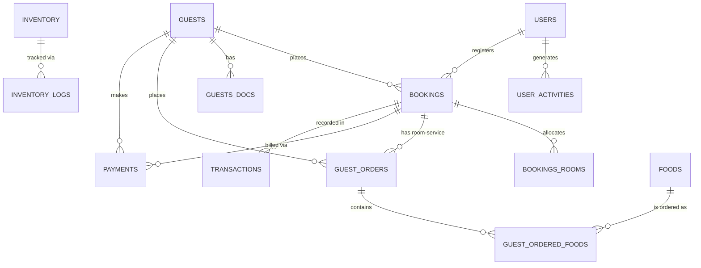

# Hotel Management System — Data Model

This document describes the complete relational database schema for all 19 domain entities. All tables share a `client` column for multi-tenant isolation and `created_at` / `updated_at` timestamps.

---

## Entity Relationship Overview

---

## Tables

### `bookings`
Central booking record linking a guest to a set of rooms for a stay duration.

| Column | Type | Description |
|---|---|---|
| `id` | bigint PK | Auto-increment booking ID |
| `guest_id` | bigint FK | Reference to `guests.id` |
| `guest_name` | varchar | Cached guest name snapshot |
| `phone` | double | Guest contact number |
| `total_guests` | double | Total persons in booking |
| `status` | varchar | `booked` · `checked_in` · `checked_out` · `cancelled` |
| `room_price` | double | Total base room cost |
| `order_price` | double | Total in-room food/services charged |
| `total_room_taxes` | double | Room GST/tax total |
| `total_order_taxes` | double | Order GST/tax total |
| `total_price` | double | Grand total bill |
| `payment_advance` | double | Advance collected at check-in |
| `payment_status` | varchar | `unpaid` · `partial` · `paid` |
| `booked_rooms` | varchar | Comma-separated room numbers |
| `booked_from` | datetime | Check-in date/time |
| `booked_to` | datetime | Checkout date/time |
| `complete_booking` | tinyint | 1 = fully checked out |
| `is_btc` | tinyint | 1 = Bill to Company |
| `btc_company` | varchar | BTC company name |
| `btc_agent` | varchar | BTC agent name |
| `btc_member` | varchar | BTC member identifier |
| `discount` | double | Discount applied on total |
| `late_charge` | double | Late checkout penalty |
| `damage_details` | json | Damage report details |
| `invoice_no` | double | Sequential invoice index |
| `invoice` | varchar | Invoice code (e.g. `INV-26052001`) |
| `invoice_date` | datetime | Invoice generated timestamp |
| `user_id` | bigint FK | Staff who registered the booking |
| `details` | json | Extra auxiliary info |
| `client` | bigint | Tenant ID |

---

### `bookings_rooms`
Each row represents one room allocated within a booking. Supports room transfers.

| Column | Type | Description |
|---|---|---|
| `id` | bigint PK | |
| `booking_id` | bigint FK | Parent booking |
| `guest_id` | bigint FK | Occupant guest |
| `room_id` | bigint | Room catalog ID |
| `room_no` | varchar | Room number |
| `status` | varchar | `booked` · `checked_in` · `checked_out` |
| `room_price` | double | Nightly rate |
| `room_tax` | double | Tax on room price |
| `checked_in_date` | date | |
| `checked_in_time` | time | |
| `checked_out_date` | date | |
| `checked_out_time` | time | |
| `rent_duration` | number | Number of nights |
| `availed_features` | json | Extra amenities booked |
| `availed_features_price` | double | Price of extra features |
| `damage_price` | double | Damage charges |
| `is_grace_enabled` | tinyint | Late checkout grace flag |
| `is_transferred` | tinyint | Room was swapped |
| `transferred_from` | bigint FK | Original `bookings_rooms.id` |
| `transfer_type` | varchar | Reason for swap |
| `extra_guest` | json | Extra guest detail overrides |
| `remarks` | varchar | Front-desk notes |
| `client` | bigint | Tenant ID |

---

### `guests`
Hotel guest directory.

| Column | Type | Description |
|---|---|---|
| `id` | bigint PK | |
| `name` | varchar | Full name |
| `phone` | double | Mobile number |
| `email` | varchar | Email address |
| `nationality` | varchar | |
| `country` / `state` / `city` / `pin` / `address` | varchar | Address fields |
| `image` | varchar | Profile photo URL |
| `guest_type` | varchar | `standard` · `VIP` · `corporate` |
| `client` | bigint | Tenant ID |

---

### `guests_docs`
Government ID document uploads per guest per stay.

| Column | Type | Description |
|---|---|---|
| `id` | bigint PK | |
| `guest_id` | bigint FK | Owner guest |
| `booking_id` | bigint FK | Associated booking |
| `doc_type` | varchar | `Aadhaar` · `Passport` · `Driving License` etc. |
| `doc_number` | varchar | Document number |
| `exp_date` | date | Document expiry |
| `doc_image` | varchar | Uploaded file URL |
| `stayed_room_no` | varchar | Room during this stay |
| `other_details` | json | Extra fields |
| `is_deleted` | tinyint | Soft-delete flag |
| `client` | bigint | Tenant ID |

---

### `guest_orders`
Food & beverage orders placed by guests (room-service or dine-in).

| Column | Type | Description |
|---|---|---|
| `id` | bigint PK | |
| `booking_id` | bigint FK | Charge to stay |
| `guest_id` | bigint FK | |
| `room_no` / `room_id` | varchar / bigint | Source room |
| `table_no` / `table_id` | varchar / bigint | Dine-in table |
| `customer_name` | varchar | Walk-in customer name (if no booking) |
| `customer_phone` | double | Walk-in phone |
| `status` | varchar | `pending` · `preparing` · `delivered` · `cancelled` |
| `total_price` | double | Order total before tax |
| `total_taxes` | double | Tax total |
| `payment_status` | varchar | `unpaid` · `paid` |
| `payment_mode` | varchar | `room` · `Cash` · `UPI` · `Card` |
| `order_type` | varchar | `room-service` · `dine-in` · `takeaway` |
| `ordered_on` | varchar | Timestamp string |
| `discount` | double | Order-level discount |
| `packaging_charge` | double | Applicable for takeaway |
| `remarks` | varchar | Special instructions |
| `details` | json | Extra KV data |
| `client` | bigint | Tenant ID |

---

### `guest_ordered_foods`
Line items within a `guest_order`.

| Column | Type | Description |
|---|---|---|
| `id` | bigint PK | |
| `order_id` | bigint FK | Parent order |
| `booking_id` | bigint FK | For direct room billing |
| `food_id` | bigint FK | Menu item reference |
| `food_name` | varchar | Cached item name |
| `quantity` | double | Units ordered |
| `price` | double | Unit price |
| `total_price` | double | `price × quantity` |
| `food_tax` | double | GST rate (%) |
| `total_taxes` | double | Tax amount |
| `status` | varchar | Kitchen preparation status |
| `client` | bigint | Tenant ID |

---

### `foods`
Hotel restaurant menu catalog.

| Column | Type | Description |
|---|---|---|
| `id` | bigint PK | |
| `name` | varchar | Dish name |
| `category` | varchar | E.g. `Main Course`, `Beverages` |
| `price` | double | Dine-in / base price |
| `rs_price` | double | Room-service price (may include markup) |
| `tax` | double | GST rate (%) |
| `client` | bigint | Tenant ID |

---

### `inventory`
Stock catalog of all hotel supplies (linens, toiletries, kitchen raw materials).

| Column | Type | Description |
|---|---|---|
| `id` | bigint PK | |
| `name` | varchar | Item name |
| `type` | varchar | Item type classification |
| `category` | varchar | E.g. `Housekeeping`, `Kitchen` |
| `quantity` | double | Total stock in hand |
| `used_quantity` | double | Currently allocated units |
| `price` | double | Cost price per unit |
| `details` | json | Extra specs |
| `remarks` | varchar | Notes |
| `client` | bigint | Tenant ID |

---

### `inventory_logs`
Audit trail of every stock movement (issue, purchase, discard).

| Column | Type | Description |
|---|---|---|
| `id` | bigint PK | |
| `item_id` | bigint FK | `inventory.id` |
| `item_name` | varchar | Cached item name |
| `room_id` / `room_no` | bigint / varchar | Target room if issued |
| `food_id` / `food_name` | bigint / varchar | Kitchen usage reference |
| `quantity` | double | Units moved |
| `before_quantity` | double | Stock level before this log |
| `log_type` | varchar | `purchase` · `issue` · `discard` |
| `type` | varchar | `hotel` · `kitchen` |
| `department` | varchar | Issuing department |
| `issued_person` | varchar | Staff member name |
| `category` / `price` / `remarks` | — | Extra metadata |
| `client` | bigint | Tenant ID |

---

### `payments`
All payment collections against a booking or order.

| Column | Type | Description |
|---|---|---|
| `id` | bigint PK | |
| `booking_id` | bigint FK | Associated booking |
| `order_id` | bigint FK | Associated order (if applicable) |
| `guest_id` | bigint FK | Payer |
| `room_no` | varchar | Room reference |
| `type` | varchar | `advance` · `partial` · `final` · `refund` |
| `amount` | double | Payment amount |
| `tax` | double | Tax on payment |
| `gst` | double | GST component |
| `total` | double | `amount + tax` |
| `mode` | varchar | `Cash` · `UPI` · `Card` · `Bank Transfer` |
| `bank` | varchar | Bank/wallet name |
| `payment_date` | varchar | Date of payment |
| `customer_type` | varchar | `individual` · `corporate` |
| `is_cancelled` | tinyint | Voided flag |
| `details` | json | Reference numbers, UTR, etc. |
| `client` | bigint | Tenant ID |

---

### `transactions`
Central general-ledger table recording all financial events.

Mirrors `payments` structure with additional `invoice`, `hsn_no`, and `gst` (string) fields for tax compliance purposes.

---

### `settings`
Key-value store for global hotel configuration.

| Column | Type | Description |
|---|---|---|
| `id` | bigint PK | |
| `key_name` | varchar | Unique config key |
| `name` | varchar | Human-readable label |
| `details` | json | Config value(s) |
| `is_deleted` | tinyint | Soft-delete flag |
| `client` | bigint | Tenant ID |

---

### `settings_options`
Enumerated option lists (e.g. room types, amenity categories).

| Column | Type | Description |
|---|---|---|
| `id` | bigint PK | |
| `key_name` | varchar | Parent setting key this option belongs to |
| `name` | varchar | Option label |
| `is_deleted` | tinyint | Soft-delete flag |
| `client` | bigint | Tenant ID |

---

### `invoice_no_counter`
Sequential invoice number generator, partitioned by year and type.

| Column | Type | Description |
|---|---|---|
| `id` | bigint PK | |
| `year_key` | varchar | E.g. `"2026"` |
| `type` | varchar | `booking` · `order` |
| `value` | double | Current counter value |
| `client` | bigint | Tenant ID |

---

### `companies`
Corporate client directory used for Bill-to-Company (BTC) bookings.

| Column | Type | Description |
|---|---|---|
| `id` | bigint PK | |
| `name` | varchar | Company name |
| `address` | varchar | Registered address |
| `gst` | varchar | GST identification number |
| `key_name` | varchar | Short identifier key |
| `client` | bigint | Tenant ID |

---

### `users`
Hotel staff accounts and their role-based permissions per module.

| Column | Type | Description |
|---|---|---|
| `id` | bigint PK | |
| `name` | varchar | Staff name |
| `email` | varchar | Login email |
| `phone` | varchar | Contact number |
| `password` | varchar | Hashed password |
| `dashboard` | json | Dashboard permission flags |
| `accounts` | json | Accounts module flags |
| `bookings` | json | Bookings module flags |
| `orders` | json | Orders module flags |
| `hotel_inventory` | json | Hotel inventory flags |
| `kitchen_inventory` | json | Kitchen inventory flags |
| `master_data` | json | Master data module flags |
| `users` | json | User management flags |
| `client` | bigint | Tenant ID |

---

### `users_activities`
Chronological audit log of all staff actions in the system.

| Column | Type | Description |
|---|---|---|
| `id` | bigint PK | |
| `activity` | varchar | Action name (e.g. `checkin`, `payment_received`) |
| `data` | json | Context payload for the activity |
| `client` | bigint | Tenant ID |

---

### `orders` & `orders_foods`
Secondary order tables mirroring `guest_orders` / `guest_ordered_foods` structure, used for standalone restaurant/POS billing where no booking is associated. Support invoice generation, order-level discounts, and packaging charges.
